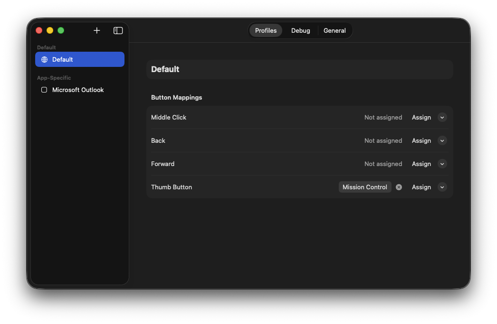

<div align="center">

# Ptions+

**A native macOS menu bar app that maps extra mouse buttons to keyboard shortcuts — per app.**

Replaces bloated vendor software with a fast, focused, open-source alternative. Built with SwiftUI.

[](https://www.apple.com/macos/)
[](https://swift.org)
[](LICENSE)

</div>

---



---

## The Problem

You have a mouse with extra buttons. The vendor's companion app is 200 MB, phones home, requires an account, and breaks after every macOS update. You just want **Back** to trigger `Cmd+[` in Safari and **Mission Control** on the thumb button everywhere else.

**Ptions+ does exactly that.** Configure button mappings per-app, set system actions, and forget about it. Runs in the menu bar, uses ~8 MB of RAM, zero network calls.

## Features

**Per-app profiles** — Different mappings for every app. Safari gets browser navigation, Xcode gets build shortcuts, everything else gets your defaults.

**System actions** — Mission Control, App Expose, Show Desktop, Launchpad — triggered via CoreDock, no keyboard shortcut workarounds.

**Shortcut recorder** — Click "Assign", press your key combo. Supports all modifier combinations.

**16 preset actions** — Spotlight, Screenshot Tool, Notification Center, Lock Screen, and more.

**Multi-mouse support** — MX Master 3/3S/2S, MX Anywhere 3, MX Ergo, MX Vertical, G502, G604, or generic 3/5-button mice.

**Launch at login** — Native `SMAppService` integration.

**Debug monitor** — Live view of raw mouse events for troubleshooting.

## Supported Mice

| Logitech MX | Logitech G | Generic |
|:---|:---|:---|
| MX Master 3 | G502 | Generic (5 buttons) |
| MX Master 3S | G604 | Generic (3 buttons) |
| MX Master 2S | | |
| MX Anywhere 3 | | |
| MX Ergo | | |
| MX Vertical | | |

> Any mouse that sends `otherMouseDown` events via HID will work. Pick the closest model or use Generic.

## Getting Started

### Prerequisites

- macOS 13 Ventura or later
- Xcode 15+
- The vendor's companion software **must be uninstalled** — it captures mouse events before Ptions+ can

### Build from source

```bash
git clone https://github.com/trsdn/PtionsPlus.git && cd PtionsPlus
xcodebuild -project PtionsPlus.xcodeproj -scheme "Ptions+" -configuration Release build
```

Copy the built app to `/Applications`:

```bash
cp -R ~/Library/Developer/Xcode/DerivedData/PtionsPlus-*/Build/Products/Release/Ptions+.app /Applications/
xattr -cr /Applications/Ptions+.app
open /Applications/Ptions+.app
```

### Grant Accessibility Access

On first launch, Ptions+ will prompt for Accessibility permissions. This is required to intercept mouse events system-wide.

**System Settings** → **Privacy & Security** → **Accessibility** → enable **Ptions+**

## How It Works

```
Mouse Button Press
       │
       ▼
  CGEventTap (EventTapService)
       │
       ▼
  Active App Lookup (ActiveAppMonitor)
       │
       ▼
  Profile Match (MappingStore)
       │
       ├── Has mapping? → KeySimulator / CoreDock → Suppress original event
       │
       └── No mapping?  → Pass through
```

A `CGEventTap` at the HID system level intercepts `otherMouseDown` / `otherMouseUp` events. Mapped buttons either simulate a keyboard shortcut via `CGEvent` posting or trigger a system action through CoreDock, then suppress the original mouse event.

## Configuration

All configuration lives in a single JSON file:

```
~/Library/Application Support/Ptions+/config.json
```

Reset to defaults:

```bash
rm ~/Library/Application\ Support/Ptions+/config.json
```

The app regenerates default config on next launch.

## Project Structure

```
PtionsPlus/
├── PtionsApp.swift              # Entry point, AppDelegate, lifecycle
├── Model/
│   ├── ButtonMapping.swift      # Data models: profiles, mappings, mice
│   └── MappingStore.swift       # JSON persistence, profile lookup
├── Services/
│   ├── EventTapService.swift    # CGEventTap — intercept mouse buttons
│   ├── KeySimulator.swift       # CGEvent posting + CoreDock actions
│   ├── ActiveAppMonitor.swift   # Tracks frontmost app bundle ID
│   ├── AccessibilityChecker.swift
│   └── MouseDetector.swift
├── Views/
│   ├── MenuBarView.swift        # Menu bar dropdown
│   ├── SettingsView.swift       # Settings window (tabbed)
│   ├── ProfileListView.swift    # Sidebar profile list
│   ├── ProfileEditorView.swift  # Button mapping editor
│   ├── ShortcutRecorderView.swift
│   ├── AppPickerView.swift
│   ├── PermissionGuideView.swift
│   └── DebugMonitorView.swift
└── Utilities/
    ├── KeyCodeMap.swift
    └── Constants.swift
```

## Disclaimer

**Ptions+ is an independent, open-source project. It is not affiliated with, endorsed by, or associated with Logitech, Logi, or any of their subsidiaries or products.** All product names, trademarks, and registered trademarks mentioned in this project are the property of their respective owners. Mouse model names are used solely for compatibility identification purposes.

## License

MIT

---

<div align="center">
  <sub>Built because life's too short for bad companion software.</sub>
</div>
