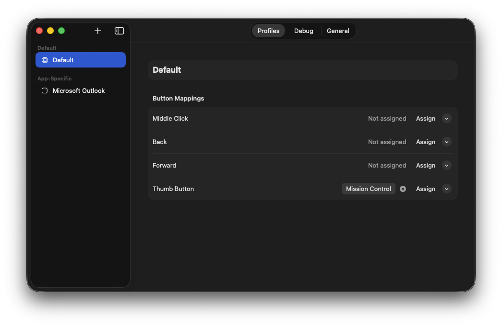
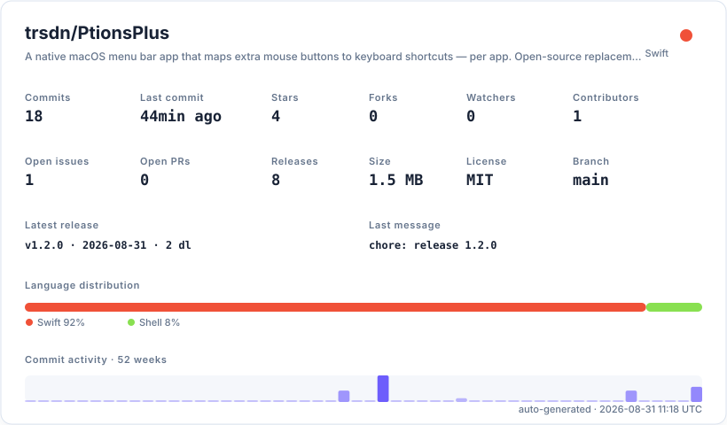

<div align="center">

# Ptions+

**A native macOS menu bar app that maps extra mouse buttons to keyboard shortcuts — per app.**

Replaces bloated vendor software with a fast, focused, open-source alternative. Built with SwiftUI.

[](LICENSE)
[](#requirements)
[](https://github.com/trsdn/PtionsPlus/actions/workflows/ci.yml?query=branch%3Amain)
[](https://github.com/trsdn/PtionsPlus/releases/latest)
[](.github/conformance.yml)

</div>

---



---

## Status

**Maintained.** Actively developed and used daily by its author. Issues and
pull requests are read; see [Support](#support) for what to expect.

The current release is on the
[releases page](https://github.com/trsdn/PtionsPlus/releases/latest), signed
with a Developer ID certificate and notarised by Apple.

## The Problem

You have a mouse with extra buttons. The vendor's companion app is 200 MB, phones home, requires an account, and breaks after every macOS update. You just want **Back** to trigger `Cmd+[` in Safari and **Mission Control** on the thumb button everywhere else.

**Ptions+ does exactly that.** Configure button mappings per-app, set system actions, and forget about it. Runs in the menu bar, uses ~8 MB of RAM, zero network calls.

## Features

**Per-app profiles** — Different mappings for every app. Safari gets browser navigation, Xcode gets build shortcuts, everything else gets your defaults.

**Multiple mice** — Every connected mouse is detected and can carry its own model, profiles, and mappings, tied to the hardware so they survive disconnecting and reconnecting. Mice without their own setup fall back to a shared configuration.

**System actions** — Mission Control, App Expose, Show Desktop, and Launchpad use a dynamically detected CoreDock integration with graceful fallback when unavailable.

**Shortcut recorder** — Click "Assign", press your key combo. Supports all modifier combinations, including system-reserved shortcuts such as Control + Arrow that macOS would otherwise swallow.

**18 preset actions** — Next/Previous Space, Spotlight, Screenshot Tool, Notification Center, Lock Screen, and more. Logical shortcuts adapt to the active keyboard layout.

**Supported mouse models** — Manually select MX Master 4/3/3S/2S, MX Anywhere 3, MX Ergo, MX Vertical, G502, G604, or a generic 3/5-button model.

**Launch at login** — Native `SMAppService` integration.

**Debug monitor** — Live view of raw mouse events, including the mouse that produced them, for troubleshooting.

## Supported Mice

| Logitech MX | Logitech G | Generic |
|:---|:---|:---|
| MX Master 4 | G502 | Generic (5 buttons) |
| MX Master 3 | G604 | Generic (3 buttons) |
| MX Master 3S | | |
| MX Master 2S | | |
| MX Anywhere 3 | | |
| MX Ergo | | |
| MX Vertical | | |

> Any mouse that sends `otherMouseDown` events via HID will work. Pick the closest model or use Generic.

## Requirements

- macOS 13 Ventura or later, Apple silicon or Intel
- Accessibility permission, granted on first launch
- No vendor mouse software installed — see [Troubleshooting](#troubleshooting)

To build from source you also need Xcode 15 or later. Ptions+ has no
third-party dependencies.

## Install

Download the latest `.dmg` or `.zip` from the
[releases page](https://github.com/trsdn/PtionsPlus/releases/latest). Each
release ships a `.sha256` file, so you can verify what you downloaded:

```bash
shasum -a 256 -c Ptions+.dmg.sha256
```

Drag `Ptions+.app` to `/Applications` and open it.

### Grant Accessibility Access

On first launch, Ptions+ will prompt for Accessibility permissions. This is required to intercept mouse events system-wide.

**System Settings** → **Privacy & Security** → **Accessibility** → enable **Ptions+**

### Grant Input Monitoring Access (optional)

Input Monitoring is only needed to tell several connected mice apart. Without it, Ptions+ still lists your mice but every one of them uses the shared mappings.

**System Settings** → **Privacy & Security** → **Input Monitoring** → enable **Ptions+**

## Build from source

```bash
git clone https://github.com/trsdn/PtionsPlus.git && cd PtionsPlus
xcodebuild -project PtionsPlus.xcodeproj -scheme "Ptions+" -configuration Release build
```

Copy the built app to `/Applications`:

```bash
cp -R ~/Library/Developer/Xcode/DerivedData/PtionsPlus-*/Build/Products/Release/Ptions+.app /Applications/
xattr -cr /Applications/Ptions+.app
open /Applications/Ptions+.app
```

Build, test, lint, and release commands are documented in
[`AGENTS.md`](AGENTS.md#commands), which is the single home for them.

### Signed Release Build

The release flow is three commands: bump version, sign, notarize.

First create your local release config:

```bash
scripts/setup-notarization.sh --gui
```

```bash
./scripts/bump-version.sh patch   # or: minor, major
bash scripts/sign-release.sh
xcrun notarytool store-credentials "PtionsPlus" \
     --apple-id "your@email.com" \
     --team-id "YOUR_TEAM_ID" \
     --password "app-specific-password"
bash scripts/notarize.sh
```

If you already have a working `notarytool` keychain profile from another project, set it in `.release.env` or inline:

```bash
TEAM_ID="YOUR_TEAM_ID"
CODE_SIGN_IDENTITY="Developer ID Application: Your Name"
NOTARY_PROFILE="your-notary-profile"
```

The release scripts produce four outputs:

- `build/PtionsPlus.xcarchive/Products/Applications/Ptions+.app`
- `dist/Ptions+.zip`
- `dist/Ptions+.dmg`
- `dist/Ptions+.dmg.sha256`

The final ZIP and DMG are rebuilt from the stapled app and verified before upload.

The GitHub release workflow builds signed, notarized artifacts on `v*` tags. Configure these repository secrets first:
`MACOS_CERTIFICATE`, `MACOS_CERTIFICATE_PWD`, `APPLE_ID`, `APPLE_TEAM_ID`, and `APPLE_APP_PASSWORD`.

## Versioning and compatibility

Ptions+ follows [semantic versioning](https://semver.org/). Releases are tagged
`vX.Y.Z`, and the tag, the app version, and the release title are validated
against each other by `scripts/verify-version.sh` before any artifact is
published.

The compatibility contract is the configuration file:

| Bump | What it means for `config.json` |
|---|---|
| **Patch** | No schema change. Downgrade is safe. |
| **Minor** | Additive schema changes only. An older version ignores fields it does not know, so downgrade is safe but may drop new settings on the next write. |
| **Major** | A breaking schema change or a change in mapping behaviour. Ptions+ backs the old file up before migrating. Downgrade is not supported. |

Ptions+ never silently replaces an unreadable configuration. A corrupt or
invalid file is preserved, interception is blocked, and the app offers an
explicit repair or reset that takes a timestamped backup first.

## How It Works

```
Mouse Button Press
       │
       ▼
  CGEventTap (EventTapService)
       │
       ▼
  Device Attribution (HIDMouseDeviceService)
       │
       ▼
  Active App Lookup (ActiveAppMonitor)
       │
       ▼
  Profile Match (MappingStore, scoped to the mouse)
       │
       ├── Has mapping? → Coordinated input / available system action → Suppress event pair
       │
       └── No mapping?  → Pass through
```

A session-level `CGEventTap` intercepts `otherMouseDown` / `otherMouseUp` events. A deterministic state machine keeps each down/up suppression decision paired per mouse, coordinates held shortcuts, and passes unsupported model buttons through. Mapped buttons either simulate a keyboard shortcut via `CGEvent` posting or trigger an available system action.

CoreGraphics events carry no hardware identity, so an `IOHIDManager` running on its own run loop records raw HID button reports and matches them against the events seen by the tap. When a report cannot be matched — for example while Input Monitoring is missing — the shared configuration is used.

## Multiple Mice

Settings has a scope selector above the tabs:

- **All Mice (Shared)** — the fallback configuration used by every mouse without its own setup.
- **A specific mouse** — its own model, profiles, global overrides, and mappings.

Use **General → Connected Mice → Configure Separately** to give a mouse its own mappings, seeded from the shared configuration. **Use Shared** deletes them again.

Mice are identified by vendor, product, and serial number, so mappings survive disconnecting and reconnecting. Hardware that reports no serial number cannot be told apart from an identical second unit; both share the same configuration, and settings flags this.

The component-level architecture, the runtime invariant, and the logging policy
are documented in [`AGENTS.md`](AGENTS.md#architecture).

## Configuration

All configuration lives in a single JSON file:

```
~/Library/Application Support/Ptions+/config.json
```

Reset to defaults:

```bash
rm ~/Library/Application\ Support/Ptions+/config.json
```

The app regenerates default config on next launch.

## Privacy

**Ptions+ collects nothing, stores nothing about you, and transmits nothing.**

- **Data collected:** none. There is no telemetry, no analytics, no crash
  reporting, no update check, and no account.
- **Network destinations:** none. The app makes no outbound network requests of
  any kind. The only network activity you will ever see from this project is
  you downloading a release from GitHub.
- **Third-party services and AI providers:** none. No user content is sent
  anywhere.
- **Local storage:** one file, `~/Library/Application Support/Ptions+/config.json`,
  containing your profiles and button mappings. It is plain JSON: you can read
  it, copy it, and back it up.
- **Retention and deletion:** the configuration persists until you delete it.
  Deleting the file, as shown under [Configuration](#configuration), removes
  everything Ptions+ has stored. Uninstalling the app does not remove it; delete
  the file yourself if you want it gone.

The [project website](https://trsdn.github.io/PtionsPlus/) follows the same
rule: every stylesheet, font, and image is served from this repository, so it
loads no third-party resources, sets no cookies, and carries no analytics.

## Accessibility

Settings are fully operable from the keyboard, and every interactive control
exposes an accessible name to VoiceOver. No state is signalled by colour alone.

Known limitations — including that recording a custom shortcut requires a
physical key press — are documented in
[`docs/accessibility.md`](docs/accessibility.md).

## Language

The primary user-facing language is **English**, and it is the only one.
Ptions+ is not localized and there is no locale list; all interface strings,
documentation, and code are English. See criterion `L03` in
[the conformance record](.github/conformance.yml).

## Troubleshooting

**Buttons do nothing at all.** Vendor mouse software captures the buttons
before Ptions+ can see them. Logi Options+, Logitech Options, Logitech G HUB,
SteerMouse, and USB Overdrive all do this. Quit and uninstall it; quitting alone
is sometimes not enough because a helper process restarts.

**Ptions+ says Accessibility access is missing after you granted it.** Remove
Ptions+ from the Accessibility list in System Settings, then add it again. macOS
keys this permission to the code signature, so replacing the app with a
different build invalidates it.

**A button is not recognised.** Open Settings → Debug and press it. If no event
appears, macOS is not delivering it as `otherMouseDown` and Ptions+ cannot map
it. If an event appears with a button number outside your selected mouse model,
switch to Generic (5 buttons).

**Presets trigger the wrong thing.** Semantic presets resolve through your
active keyboard layout, and Spotlight and Notification Center assume the default
macOS shortcuts. If you have reassigned those in System Settings, record a
custom shortcut instead.

## Security

Report vulnerabilities privately through
[a security advisory](https://github.com/trsdn/PtionsPlus/security/advisories/new).
Do not open a public issue. The full policy is in
[`trsdn/.github`](https://github.com/trsdn/.github/blob/main/SECURITY.md).

Ptions+ requires Accessibility permission, which is a genuinely powerful grant:
it allows the app to observe input events and post synthetic ones. The code that
uses it is small and is all under `PtionsPlus/Services/`. The app runs with the
App Sandbox disabled because macOS does not permit global event interception
from inside the sandbox.

## Support

This is a personal open-source project maintained in spare time, offered as-is
under the MIT licence with no guaranteed response time.

- **Bugs and features:** open an [issue](https://github.com/trsdn/PtionsPlus/issues/new/choose).
  The forms ask for the details needed to reproduce a problem.
- **Questions:** see [SUPPORT.md](https://github.com/trsdn/.github/blob/main/SUPPORT.md).
- **Contributing:** see [CONTRIBUTING.md](https://github.com/trsdn/.github/blob/main/CONTRIBUTING.md)
  and [`AGENTS.md`](AGENTS.md) for the build and validation commands.

## Repository stats

<picture>
  <source media="(prefers-color-scheme: dark)" srcset=".github/stats/repo-card-dark.svg">
  
</picture>

Generated weekly by [`.github/workflows/repo-stats.yml`](.github/workflows/repo-stats.yml)
and committed to this repository, so reading this page does not contact a
third-party image service.

## Disclaimer

**Ptions+ is an independent, open-source project. It is not affiliated with, endorsed by, or associated with Logitech, Logi, or any of their subsidiaries or products.** All product names, trademarks, and registered trademarks mentioned in this project are the property of their respective owners. Mouse model names are used solely for compatibility identification purposes.

## License

MIT — see [LICENSE](LICENSE).

---

<div align="center">
  <sub>Built because life's too short for bad companion software.</sub>
</div>
